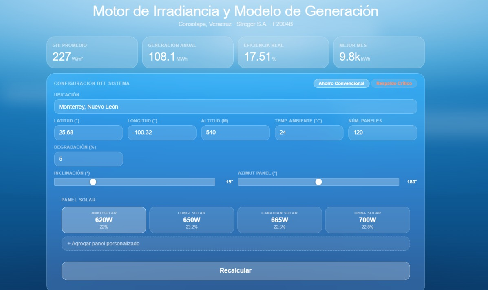
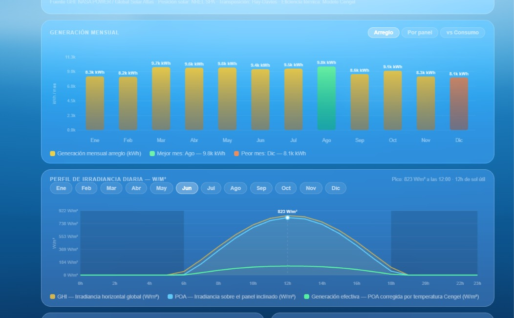

# Motor de Irradiancia y Modelo de Generación Solar

Herramienta interactiva, en un solo archivo HTML, para modelar la generación de un sistema
solar fotovoltaico y su impacto económico real en una planta industrial (caso de uso:
farmacéutica con operación crítica 24/7). Todo el cálculo: posición solar, irradiancia,
generación, eficiencia térmica, respaldo crítico y ahorro, corre en el navegador, sin backend.

## Qué hace

- **Modelo de posición solar y de irradiancia (SPA)**: calcula la posición del sol y la
  irradiancia horaria (GHI y POA) para cualquier ubicación (latitud, longitud, altitud),
  con opción de traer datos climatológicos reales de la API de **NASA POWER**.
- **Generación mensual y diaria**: estima la generación (kWh) por panel y por arreglo,
  corrigiendo por temperatura ambiente con el **modelo de Cengel** para eficiencia térmica real.
- **Selección y comparación de paneles solares**: catálogo con specs de fabricantes reales
  (Jinko, LONGi, Canadian Solar, Trina) o panel personalizado.
- **Optimización de posición**: evalúa combinaciones de inclinación/azimut para maximizar
  generación en un mes dado, con mapa de calor de resultados.
- **Modelo de demanda / consumo**: genera curvas de consumo horario típicas de un laboratorio
  farmacéutico (turnos, fines de semana, estacionalidad) para comparar generación solar vs.
  consumo real.
- **Sistemas críticos y respaldo (modo UPS/GMP)**: permite activar/desactivar equipos críticos
  (HVAC, bombas de agua purificada, cámaras frías) y calcula automáticamente el dimensionamiento
  de inversor y baterías necesario para mantenerlos operando en un apagón.
- **Análisis de ahorro y ROI real**: desglosa una factura CFE (tarifa GDMTO) en sus componentes
  (energía, distribución, transmisión, capacidad) para calcular qué porcentaje del recibo
  realmente puede desplazar la energía solar — no todo el kWh facturado es "ahorrable".

## Capturas

**Generación mensual y perfil de irradiancia diaria**

**Panel de sistemas críticos (modo respaldo GMP)**

## Cómo usarlo

No requiere instalación ni build. Simplemente:

1. Descarga o clona el repositorio.
2. Abre `index.html` en cualquier navegador moderno.
3. Ingresa ubicación, specs del sistema (número de paneles, inclinación, azimut, panel solar) y
   presiona **Recalcular**.

> **Nota:** la consulta a la API de NASA POWER requiere conexión a internet; si no está
> disponible, la herramienta usa un modelo de irradiancia calibrado como respaldo.

## Stack

- HTML, CSS y JavaScript puro (sin frameworks, sin dependencias externas).
- Gráficas dibujadas directamente en `<canvas>`.
- Fuente de datos climáticos: [NASA POWER API](https://power.larc.nasa.gov/).

## Contexto de los cálculos financieros

Los precios y desglose de tarifa (`$/kWh`, cargos fijos, etc.) usados en el módulo de ahorro
están basados en un recibo real de CFE bajo tarifa **GDMTO**, y sirven como ejemplo de cómo
descomponer una factura industrial mexicana para saber qué parte del costo realmente reduce la
energía solar (solo el cargo de energía, no los cargos de red ni de capacidad contratada).
Ajusta las constantes en el bloque `ANÁLISIS DE AHORRO REAL` del script si tu caso usa otra
tarifa o recibo.
